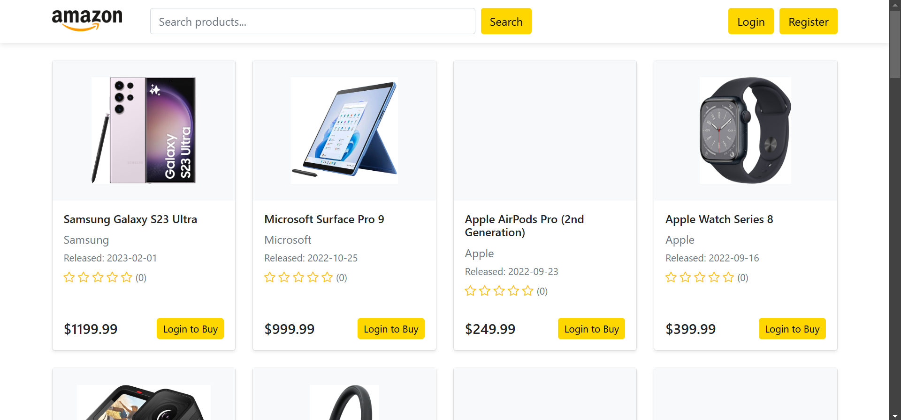

Note: This is a copy of the final project I submitted for CS50x 2024
***
# Amazon Clone
#### Video Demo:  https://www.youtube.com/watch?v=02sUwO-qNaE
#### Description:
This project is a clone of Amazon built using Flask, a lightweight Python web framework. The website replicates core functionalities of Amazon.com, providing users with a familiar e-commerce experience. Users can create accounts, browse products, manage their shopping carts, place orders, and write product reviews.



## Features

### User Authentication
- **User Registration**: New users can create accounts with email verification
- **User Login**: Secure login system with password hashing
- **Password Recovery**: Reset password functionality via email
- **User Profile**: Users can view and update their profile information

### Product Management
- **Product Catalog**: Browse through various categories of products
- **Product Details**: Detailed product pages with descriptions, prices, and reviews
- **Search Functionality**: Search products by name, category, or description
- **Product Filtering**: Filter products by price range, category, and ratings

### Shopping Features
- **Shopping Cart**: Add/remove products, update quantities
- **Wishlist**: Save products for later
- **Order Processing**: Secure checkout process
- **Order History**: View past orders and their status
- **Product Reviews**: Write and read product reviews
- **Rating System**: Rate products on a 5-star scale

### Additional Features
- **Responsive Design**: Works seamlessly on desktop and mobile devices
- **Payment Integration**: Secure payment processing
- **Email Notifications**: Order confirmations and status updates
- **Admin Panel**: Manage products, orders, and user accounts

## Technologies Used

### Frontend
- **HTML5**: Structure and content
- **CSS3**: Styling and animations
- **JavaScript**: Interactive features
- **Bootstrap**: Responsive design framework

### Backend
- **Python**: Primary programming language
- **Flask**: Web framework
- **SQLite**: Database management
- **SQLAlchemy**: ORM (Object-Relational Mapping)
- **Flask-Login**: User session management
- **Werkzeug**: Password hashing and security

## Setup and Installation

1. Clone the repository:
```bash
git clone https://github.com/GitIshaan/amazon-clone.git
cd amazon-clone
```

2. Create a virtual environment:
```bash
python -m venv venv
source venv/bin/activate  # On Windows: venv\Scripts\activate
```

3. Install required packages:
```bash
pip install -r requirements.txt
```

4. Initialize the database:
```bash
flask db init
flask db migrate
flask db upgrade
```

5. Run the application:
```bash
flask run
```

## Database Structure

The application uses SQLite with the following main tables:
- **Users**: Store user information and credentials
- **Products**: Product details and inventory
- **Orders**: Order information and status
- **Cart**: Shopping cart items
- **Reviews**: Product reviews and ratings

## Security Features

- Password hashing using Werkzeug
- CSRF protection
- Secure session management
- Input validation and sanitization
- Protected API endpoints
- Secure payment processing
